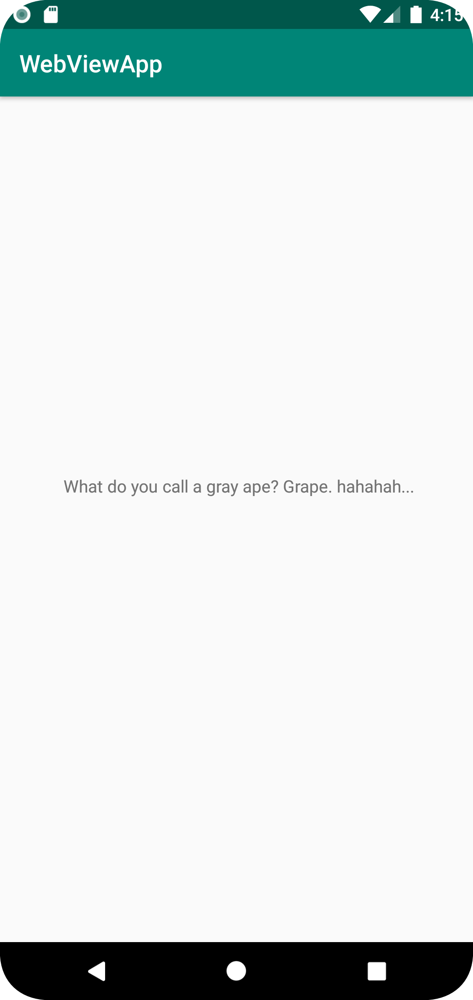

Idag skapade jag ett GitHub konto med min skolmail. Sedan forkade jag appen hello och klonade forken till Android Studio från mitt GitHub.
Därefter letade jag efter filen vilket innehöll texten som skulle ändras, det fanns under layout. Texten ändrades till ett jätte roligt skämt.
Sist så skedde en modifiering, push och commit.

...
 TextView android:text=" What do you call a gray ape? Grape. hahahah..."
...

Bilder läggs i samma mapp som markdown-filen.

